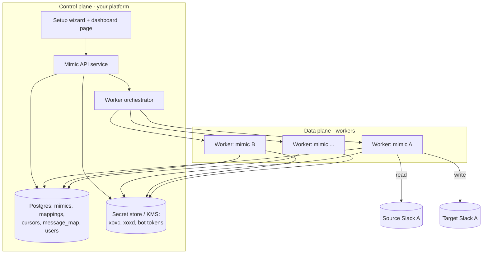
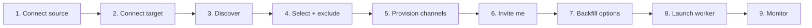

# Slack Mimic — Platform Integration & Productionization Guide

How to take the single-tenant CLI in this repo and turn it into a **multi-tenant
platform feature**: a page where any user can set up a Slack-mimic workflow
end-to-end (connect workspaces → provision channels → invite themselves → run a
worker), and where **many mimics run concurrently as managed workers**.

This guide is written for the engineers integrating it and doubles as the spec
for the end-user setup wizard the page will expose.

---

## 0. Read this first — the hard constraint

The whole tool works by **reusing a user's Slack session credentials**
(`xoxc-` token + `xoxd-` `d` cookie) to read a workspace that blocks app
installation. That is against Slack's Terms of Service and can get the source
account flagged. Productionizing means you are now doing this **at scale, on
behalf of many users, storing their session credentials on your servers.**

Before building, decide deliberately:

- **Consent & ownership.** Only a user's own account/credentials, only workspaces
  they belong to. Make the ToS risk explicit in the UI and require acknowledgement.
- **Blast radius.** A leaked credential store = full Slack access to every
  connected account. Treat credentials as the crown jewels (see §7).
- **Liability.** Get sign-off from whoever owns legal/security for your platform.

Everything below assumes that decision is made and the answer is "proceed."

---

## 1. What exists today (the building blocks)

The current repo is a working, tested single mimic. The productionization reuses
its logic almost verbatim — the units are already cleanly separated.

| Module | Role | Reused as |
|---|---|---|
| `client_hs.py` `HeartStampClient` | Read source via `xoxc`+cookie (`auth.test`, `conversations.history/replies`, `users.info`, `users.conversations`, `rtm.connect`, `download_file`) | **Source adapter** |
| `sink/client_target.py` `TargetClient` | Bot-token writes (`chat.*`, file upload, `conversations.create/list/join/invite/rename/archive`) | **Target adapter** |
| `source/reader.py` `SourceReader` | Poll + websocket, cursor-based, emits events | **Worker ingest loop** |
| `source/normalize.py` | Raw Slack payload → `SourceEvent` | pure fn, unchanged |
| `transform/transformer.py` | `SourceEvent` → `TargetAction` (mentions, author, thread map) | pure-ish, unchanged |
| `sink/poster.py` `Poster` | Apply action to target (create/edit/delete/reaction/file) | **Worker egress** |
| `state/store.py` `StateStore` | SQLite: cursors, message map, user cache | **→ replace with Postgres (§6)** |
| `users.py` `UserResolver` | id → name/avatar with caching | unchanged |
| `provision.py` | `list_source_channels`, `list_source_dms`, `provision(_sources)`, `render_config_yaml`, `normalize_channel_name`, `short_group_name` | **Setup-wizard backend** |
| `app.py` `run()` | Wire units, queue, transport supervisor | **Worker entrypoint** |
| `scripts/*` | check_auth, probe_hs, provision, provision_dms, invite_me, rename_dms, remove_group_dms, set_cursor_now | **API endpoint logic** |

**Key insight:** the scripts are already the "workflow steps." Productionizing is
mostly (a) parametrizing everything by a per-mimic config object instead of global
`.env`/`config.yaml`, (b) swapping SQLite for a shared DB, and (c) running `run()`
once per mimic under an orchestrator.

---

## 2. Target architecture

Split into a **control plane** (your platform: page + API + DB) and a **data
plane** (workers doing the mirroring).



- **One logical worker per mimic.** A "mimic" = one source workspace → one target
  workspace + its channel mapping + options. Each runs the existing `run()` loop.
- **Orchestrator** starts/stops/restarts workers and tracks health. Options in §8.
- **Everything is keyed by `mimic_id`.** No global config, no shared cursor file.

---

## 3. The "mimic" as a first-class object

Replace `Config`/`Secrets`/`config.yaml`/`.env` with a DB-backed config the API
builds and the worker consumes. Conceptually:

```jsonc
// mimic
{
  "id": "mim_9f3…",
  "owner_user_id": "platform-user-123",
  "name": "HeartStamp → my workspace",
  "status": "draft | provisioning | running | paused | error | stopped",
  "source": { "team_id": "T097…", "team_url": "https://….slack.com", "user_id": "U0AT…" },
  "target": { "team_id": "TVANTA…", "bot_user_id": "U…" },
  "options": {
    "use_websocket": true,
    "poll_interval_seconds": 5,
    "backfill_days": 7,
    "mirror_files": true,
    "mirror_reactions": true
  },
  "created_at": "…", "updated_at": "…"
}
```

Credentials (`xoxc`, `xoxd`, target bot token) are **not** stored on this object —
they live in the secret store, referenced by `mimic_id` (see §7).

`config.py` becomes a thin loader that hydrates a `Config` from a mimic row +
secret fetch, so the existing `run()` signature barely changes.

---

## 4. The end-to-end setup wizard (what the page does "from scratch")

This is the all-in-one workflow. Each step maps to an API call that wraps the
existing library functions. The UI is a stepper; state is saved per step so a
user can resume.



### Step 1 — Connect source (session credentials)
- UI: guided extraction (the `README.md` DevTools walkthrough), fields for
  `xoxc` token + `d` cookie. Show the ToS acknowledgement checkbox here.
- Backend: `HeartStampClient.auth_test()` (logic from `scripts/check_hs_auth.py`).
  On success, store team/user identity on the mimic; store creds in secret store.
- Validation states: OK / `invalid_auth` (bad creds) / network error.

### Step 2 — Connect target (bot token)
- UI: two paths —
  1. **Guided app creation** (current approach): user creates a Slack app in their
     own workspace, adds scopes `chat:write`, `chat:write.customize`, `files:write`,
     `reactions:write`, `channels:manage`, `groups:write`, `channels:read`,
     `groups:read`, `channels:join`, and pastes the `xoxb-` token.
  2. **OAuth "Add to Slack"** (better UX at scale): host a Slack app, run the
     OAuth install flow, receive the bot token via callback. Removes manual scope
     setup. Strongly recommended for a real product.
- Backend: `TargetClient.auth_test()` (logic from `scripts/check_auth.py`).

### Step 3 — Discover source conversations
- Backend: `provision.list_source_channels()` (public/private) and
  `provision.list_source_dms()` (im/mpim) — logic already in `scripts/probe_hs.py`
  + `provision.py`. Return a selectable tree: Channels / 1:1 DMs / Group DMs.

### Step 4 — Select what to mirror + exclusions
- UI: checkboxes per conversation; global toggles ("all public channels", "all
  1:1 DMs", "group DMs on/off"); an **exclusion list** (e.g. exclude the DM with a
  specific person — the "Keith" case — and app DMs like Linear/Claude/Slackbot).
- Backend: persist selections + `exclude_user_names` into the mimic's mapping plan.
  Reuse the `list_source_dms(exclude_user_names=…)` filter.

### Step 5 — Provision target channels
- Backend: `provision.provision_sources()` — creates/reuses target channels,
  private-stays-private, auto-joins the bot; for group DMs apply
  `short_group_name()` to avoid unwieldy `mpdm-…` names. Persist the
  `source→target` map into `channel_map` rows.
- This is a **long, rate-limited** operation → run it as a background job with
  progress events (see §9 job model), not a single request.

### Step 6 — Invite the user to the created channels
- Backend: `TargetClient.conversations_invite()` per target channel (logic from
  `scripts/invite_me.py`). Needs the platform user's **target-workspace member id**
  — collect it in Step 2, or resolve via `users.lookupByEmail` (add `users:read`,
  `users:read.email` scopes) so the wizard can do it automatically.

### Step 7 — Backfill options
- UI: global backfill window (default 7 days) + **per-channel overrides** ("start
  from now" for noisy app DMs). Maps to seeding cursors: channels seeded to *now*
  skip backfill (logic from `scripts/set_cursor_now.py`), others get
  `initialize_cursors(backfill_days)`.

### Step 8 — Launch the worker
- Backend: set mimic `status = running`; orchestrator starts a worker running
  `app.run(config, backfill_days=…)`. Cursors persist in Postgres so restarts
  resume with no dupes.

### Step 9 — Monitor
- Dashboard row per mimic: status, last event time, backfill progress,
  messages mirrored, auth health, error banner. Controls: pause/resume/stop,
  re-provision, edit mapping, rotate credentials.

---

## 5. API surface

Thin REST/RPC over the existing functions. All scoped to the authenticated
platform user; `mimic_id` in the path.

| Method & path | Wraps | Notes |
|---|---|---|
| `POST /mimics` | create draft | returns `mimic_id` |
| `POST /mimics/{id}/source` | `auth_test` | store source creds + identity |
| `POST /mimics/{id}/target` | `auth_test` | bot token or OAuth callback |
| `GET  /mimics/{id}/discover` | `list_source_channels`, `list_source_dms` | selectable tree |
| `PUT  /mimics/{id}/selection` | persist mapping plan + exclusions | |
| `POST /mimics/{id}/provision` | `provision_sources` (+rename) | **async job**, returns `job_id` |
| `POST /mimics/{id}/invite` | `conversations_invite` | **async job** |
| `PUT  /mimics/{id}/backfill` | cursor seeding + `backfill_days` | per-channel overrides |
| `POST /mimics/{id}/start` | orchestrator start | |
| `POST /mimics/{id}/pause` `/stop` | orchestrator stop | |
| `GET  /mimics/{id}` `/mimics` | status + metrics | dashboard |
| `GET  /jobs/{job_id}` | progress/stream | SSE/websocket for live progress |
| `POST /mimics/{id}/credentials` | rotate `xoxc`/`xoxd`/bot | on auth failure |

Long operations (provision, invite, backfill) are **jobs** with progress, because
they're rate-limited and take minutes — the current scripts already hit Slack 429s
and back off; surface that as job progress instead of a hung request.

---

## 6. Data model (Postgres)

Replace `state/store.py`'s SQLite with shared tables. Keep the same three concerns
(cursors, message map, user cache) but namespaced by `mimic_id`.

```sql
CREATE TABLE mimics (
  id              text PRIMARY KEY,
  owner_user_id   text NOT NULL,
  name            text NOT NULL,
  status          text NOT NULL DEFAULT 'draft',
  source_team_id  text, source_user_id text, source_team_url text,
  target_team_id  text, target_bot_user_id text,
  options         jsonb NOT NULL DEFAULT '{}',
  created_at      timestamptz NOT NULL DEFAULT now(),
  updated_at      timestamptz NOT NULL DEFAULT now()
);

CREATE TABLE channel_map (
  mimic_id        text NOT NULL REFERENCES mimics(id) ON DELETE CASCADE,
  source_channel  text NOT NULL,
  target_channel  text NOT NULL,
  label           text NOT NULL DEFAULT '',
  kind            text NOT NULL DEFAULT 'channel',  -- channel | dm | group_dm
  PRIMARY KEY (mimic_id, source_channel)
);

CREATE TABLE cursors (
  mimic_id        text NOT NULL REFERENCES mimics(id) ON DELETE CASCADE,
  source_channel  text NOT NULL,
  last_ts         text NOT NULL,
  PRIMARY KEY (mimic_id, source_channel)
);

CREATE TABLE message_map (
  mimic_id        text NOT NULL REFERENCES mimics(id) ON DELETE CASCADE,
  source_channel  text NOT NULL,
  source_ts       text NOT NULL,
  target_channel  text NOT NULL,
  target_ts       text NOT NULL,
  PRIMARY KEY (mimic_id, source_channel, source_ts)
);

CREATE TABLE user_cache (
  mimic_id  text NOT NULL REFERENCES mimics(id) ON DELETE CASCADE,
  user_id   text NOT NULL,
  name      text NOT NULL,
  icon_url  text NOT NULL DEFAULT '',
  PRIMARY KEY (mimic_id, user_id)
);
```

`StateStore` keeps its exact method names (`get_last_ts`, `record_mapping`, …) —
just re-implement against Postgres with `mimic_id` bound at construction. The rest
of the code (`Poster`, `SourceReader`) needs **no changes** because it only calls
those methods.

> Use `asyncpg`/SQLAlchemy async. Keep per-mimic connection scoping so one tenant
> can't read another's rows — enforce `mimic_id` in every query (and consider
> Postgres RLS as defense in depth).

---

## 7. Secrets — the part you cannot get wrong

You are storing, per mimic: a source `xoxc` token, a source `xoxd` cookie, and a
target bot token. Any one leak is a full account compromise.

- **Never** store them in `mimics`/`channel_map` or any table you query broadly.
  Use a dedicated secret store: cloud KMS-envelope-encrypted rows, HashiCorp Vault,
  AWS Secrets Manager, or at minimum a separate encrypted table with app-level
  envelope encryption (per-mimic data key wrapped by a KMS master key).
- **Encrypt at rest, decrypt only in the worker** that needs it, in memory, for the
  duration of the run. The API service fetches them only to validate.
- **Least privilege:** workers can read only their own mimic's secrets.
- **Rotation:** the client already raises `AuthError` on `invalid_auth`/`not_authed`
  and the daemon pauses instead of hammering. Wire that to flip mimic `status=error`
  and prompt the user to re-supply credentials (`POST /credentials`). `xoxd` rotates
  often — expect this routinely.
- **Redaction:** never log token/cookie values. Scrub logs (the worker currently
  logs channel ids and errors, which is fine; make sure creds never enter a log
  line). Never emit credentials in job progress or metrics.
- **Deletion:** deleting a mimic must hard-delete its secrets (and ideally archive
  its target channels via `conversations_archive`, logic in
  `scripts/remove_group_dms.py`).

---

## 8. Running many workers (orchestration)

Each mimic runs the existing `app.run()` loop (queue + `_consume` + `_run_source`
with websocket→polling fallback). Pick an orchestration model by scale:

**Option A — Single supervisor process, many asyncio tasks (start here).**
One service holds a dict of `mimic_id → asyncio.Task` each running `run()`. Cheap,
simple, good to ~dozens of mimics on one box. Add a control channel (Redis
pub/sub or a DB poll) so the API can signal start/stop.
- Pros: trivial to build from today's code; shared connection pools.
- Cons: one process = one failure domain; noisy-neighbor CPU/memory; a crash takes
  all mimics down until restart. (You already saw a low-memory kill in dev.)

**Option B — Process/container per mimic, managed by a controller.**
The orchestrator spawns a container (or `systemd` template unit
`slackmimic@<mimic_id>.service`) per mimic running `slack-mimic --mimic-id …`.
- Pros: isolation, independent restart, per-mimic resource limits.
- Cons: heavier; needs a scheduler (Nomad/k8s/systemd) and image plumbing.

**Option C — Kubernetes.**
A controller creates a `Deployment` (or a slot in a StatefulSet) per mimic, or a
single Deployment that shards mimics across replicas via a lease table.
- Pros: production-grade scaling, health checks, auto-restart.
- Cons: most ops overhead.

**Recommendation:** ship Option A behind the API to validate the product, design
the worker so `run(config)` is the only entrypoint (it already is), then graduate
to B/C without touching mirror logic. Add a **lease/heartbeat table** early
(`mimic_id, worker_id, heartbeat_at`) so exactly one worker owns each mimic —
essential once you have more than one host.

### Cross-mimic rate limiting (critical)
Slack rate-limits **per token**. Two dimensions:
- **Source token:** all of one user's mimics (rare) and the worker's own polling
  share the `xoxc` token's budget. The client already retries on HTTP 429 with
  `Retry-After` (`client_hs._call`) — keep that, and prefer the websocket transport
  to cut history polling.
- **Target bot token:** provisioning/backfill are burst-heavy. `TargetClient._call`
  already honors `Retry-After`. For many concurrent mimics, add a **per-token
  limiter** (token-bucket keyed by target team) so parallel backfills don't
  stampede one workspace. Backfill of many channels should be paced (the scripts
  already `sleep` between creates).

---

## 9. Jobs & progress (provision / invite / backfill)

These are minutes-long and rate-limited. Model them as jobs:

- `jobs(id, mimic_id, type, status, total, done, errors jsonb, created_at)`.
- Worker publishes progress (Redis/DB) → API streams via SSE/websocket → wizard
  shows "created 41/121, rate-limited, retrying…". This mirrors exactly what the
  CLI printed; you're just surfacing it in the UI.
- Make them **idempotent & resumable**: provision reuses existing same-named
  channels (already implemented via `list_target_index` + name match); invite skips
  `already_in_channel`; backfill is cursor-based. Re-running a failed job is safe.

---

## 10. Refactor checklist (concrete, ordered)

1. **Parametrize credentials & config.** Change `run(config)` callers to build
   `Config` from a mimic row + secret fetch instead of `load_config()` reading
   `.env`/`config.yaml`. `Config`, `ChannelMap`, `Secrets` stay as-is.
2. **Postgres `StateStore`.** Re-implement `state/store.py` against Postgres,
   constructor takes `mimic_id`; keep method names. Everything downstream is
   untouched. Add a migration for the §6 schema.
3. **Channel map from DB, not YAML.** `Config.channels` is populated from
   `channel_map` rows. Drop `render_config_yaml`/YAML load in the platform path
   (keep for the standalone CLI).
4. **Secret store adapter.** Small interface `get_secrets(mimic_id) -> Secrets`,
   backed by KMS/Vault. API validates; worker consumes.
5. **Wrap scripts as service functions.** `provision.py` is already a library;
   expose `discover`, `provision`, `invite`, `set_cursor_now`, `rename`,
   `remove_group_dms` as callable jobs. Delete the argparse `scripts/*` wrappers
   from the platform build (keep for local ops).
6. **Orchestrator + control channel** (Option A): a supervisor with start/stop,
   lease/heartbeat table, and a signal path from the API.
7. **Auth-failure → status.** Map `AuthError` to `status=error` + user prompt.
8. **Per-token rate limiter** for target writes across mimics.
9. **Observability:** structured logs (no secrets), per-mimic metrics
   (events mirrored, lag, 429s, auth failures), health endpoint.
10. **UI:** the §4 wizard + §9 progress + dashboard.

Ship 1–3 first (makes it multi-tenant-capable), then 4–8 (makes it safe and
concurrent), then 9–10 (makes it a product).

---

## 11. Security, compliance, isolation (summary)

- **Tenant isolation:** every query bound by `mimic_id`; consider Postgres RLS.
  Workers scoped to a single mimic's secrets.
- **ToS acknowledgement** captured per mimic, with timestamp, before source creds
  are accepted.
- **Data minimization:** mirrored message content passes through workers; decide
  whether you retain any of it beyond the `message_map` (ids/ts only — recommended)
  or store bodies (avoid unless required).
- **Audit log:** who created/started/stopped/deleted mimics and when.
- **Free-tier target caveat:** ~90-day retention on free Slack workspaces; posting
  is unaffected. Surface this in the UI.
- **Deletion/offboarding:** hard-delete secrets, optionally archive created target
  channels, purge cursors/maps.

---

## 12. Testing & rollout

- The existing unit suite (`tests/`, 48 tests) covers normalize/transform/poster/
  store/config/provision logic — keep it; add Postgres `StateStore` tests
  (same cases as `test_store.py`) and job idempotency tests.
- **Staged rollout:** internal dogfood (your own mimic — already running) →
  a handful of trusted users → GA behind the ToS gate.
- **Load test** provisioning + backfill against a scratch workspace to tune the
  per-token limiter before onboarding many users.

---

## 13. Milestones

| Milestone | Deliverable |
|---|---|
| M1 — Multi-tenant core | Postgres `StateStore`, mimic-parametrized `run()`, secret adapter |
| M2 — Wizard backend | discover/provision/invite/backfill as async jobs + progress |
| M3 — Orchestrator | Option A supervisor, lease/heartbeat, start/stop, auth-failure handling |
| M4 — Page | setup wizard UI + dashboard + live job progress |
| M5 — Hardening | per-token rate limiter, observability, audit log, deletion flow |
| M6 — Scale | graduate to Option B/C orchestration as tenant count grows |

---

## Appendix — mapping current CLI ops to platform steps

| CLI script (today) | Platform step | API |
|---|---|---|
| `check_hs_auth.py` / `check_auth.py` | Connect source / target | `POST /source`, `POST /target` |
| `probe_hs.py` + `list_source_channels/dms` | Discover | `GET /discover` |
| `provision.py` / `provision_dms.py` | Provision channels | `POST /provision` (job) |
| `rename_dms.py` (`short_group_name`) | Provision (naming) | part of provision job |
| `invite_me.py` | Invite me | `POST /invite` (job) |
| `set_cursor_now.py` | Backfill overrides | `PUT /backfill` |
| `remove_group_dms.py` | Edit mapping / offboard | `PUT /selection`, delete flow |
| `slack-mimic` (`app.run`) | Launch worker | `POST /start` |
